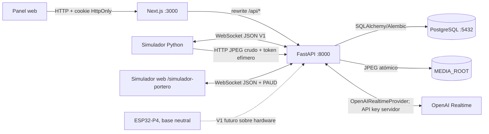

# Arquitectura de Portero Inteligente — MVP1 + SIM-1

## Alcance

El proyecto es un monorepo simulator-first que corre localmente en Windows. PostgreSQL
vive en Docker Compose; FastAPI, Next.js y los simuladores son procesos locales. MVP1
mantiene administración, presencia, comandos y captura. SIM-1 agrega una pantalla que
emula el futuro portero y una conversación de voz OpenAI Realtime extremo a extremo.

El navegador nunca se conecta directamente a OpenAI. El simulador web autentica como un
dispositivo mediante challenge/HMAC y transporta PCM16 por `/ws/device`; sólo FastAPI
conoce `OPENAI_API_KEY` y abre el WebSocket externo.

## Límites de confianza y responsabilidades

### Navegador y frontend

Next.js App Router ofrece login y el panel. El navegador sólo conserva la cookie de sesión
HttpOnly emitida por FastAPI; no persiste tokens en `localStorage`. En desarrollo, Next
reescribe `/api/*` hacia `BACKEND_ORIGIN`, por defecto `http://localhost:8000`, de modo que
la cookie siga viajando por un origen de navegador coherente. Zod y React Hook Form mejoran
la experiencia, pero toda autorización y validación autoritativa reside en FastAPI.

El panel usa polling REST acotado para dashboard, dispositivos, comandos, eventos,
estadísticas y diagnóstico. La ruta pública independiente `/simulador-portero` es la
excepción deliberada: actúa como dispositivo y usa `/ws/device`, sin cookie administrativa
ni conexión browser-to-OpenAI. Su secreto se mantiene sólo en memoria.

### Backend

FastAPI expone:

- autenticación y sesión en `/api/auth/*`;
- recursos multi-vivienda en `/api/homes/*`;
- WebSocket de dispositivos en `/ws/device`;
- upload del dispositivo en `/api/device/media`;
- liveness `/health` y readiness PostgreSQL `/ready`.

Las responsabilidades están separadas entre `api` (adaptadores HTTP), `auth` y RBAC,
`devices` (credenciales, presencia, comandos y codec `PAUD`), `websocket` (sesión V1),
`ai` (coordinador, `OpenAIRealtimeProvider` y `FakeRealtimeProvider`), `media`
(validación/almacenamiento), `services` (casos de uso), `audit` y `database`. Pydantic
Settings es el único origen de configuración del proceso. Las respuestas y logs excluyen
passwords, cookies completas, secretos de dispositivo, tokens de upload, API keys, audio
y payloads externos crudos.

### Persistencia

PostgreSQL es la fuente durable para identidades, membresías/roles, sesiones hasheadas,
credenciales cifradas, challenges, configuración del agente, dispositivos, comandos,
eventos, conversaciones, metadatos de media y auditoría. Alembic es la autoridad del
esquema. SIM-1 crea la conversación durable sólo después de confirmar Realtime y conserva
únicamente transcripciones finales deduplicadas; no hay columnas ni filas de audio.

Los JPEG se guardan fuera de PostgreSQL bajo `MEDIA_ROOT`. El backend decide todas las
rutas, limita el streaming, valida marcadores JPEG, sincroniza un temporal y publica con
reemplazo atómico. La base sólo guarda metadatos y una ruta relativa confinada.

### Dispositivo y simulador

El simulador Python implementa el contrato MVP1: challenge HMAC, `boot_id` y `seq`,
snapshot/heartbeat, ACK/RESULT, captura JPEG y reconexión con backoff. El simulador web
agrega la capacidad `audio_pcm16_v1`, framing `PAUD`, AudioWorklet, micrófono y parlante
manos libres. Ninguno persiste el secreto ni lo registra.

La base de firmware mantiene protocolo, estado y HAL desacoplados. No contiene
configuraciones GPIO, PHY, I2S o cámara inventadas.

## Flujos principales

### Usuario web

1. Bootstrap crea roles, permisos, vivienda y administrador de forma idempotente.
2. Login valida Argon2id, guarda sólo el hash de un token opaco y emite una cookie HttpOnly.
3. Cada ruta sensible vuelve a resolver usuario, vivienda y permiso en backend.
4. Los cambios del agente, usuarios, dispositivos y comandos se confirman en PostgreSQL y
   escriben auditoría saneada.

### Dispositivo

1. El operador crea `PI-000001`; el secreto aleatorio se muestra sólo en esa respuesta y
   queda cifrado en PostgreSQL.
2. El dispositivo autentica `/ws/device` con challenge HMAC de un solo uso.
3. FastAPI mantiene la propiedad de la conexión y el token efímero de upload en memoria;
   presencia y transiciones se guardan en PostgreSQL.
4. Un comando se persiste antes de enviarse. ACK, RESULT, fallo y timeout usan transiciones
   validadas y auditables.
5. `camera.capture` correlaciona el upload crudo con `command_id`, crea evento y media, y
   devuelve una URL que sólo abre una sesión web con permiso `camera.view`.

### Conversación de voz SIM-1

1. El simulador web anuncia `audio_pcm16_v1`, completa challenge/HMAC y envía
   `conversation.start`; nunca envía prompt, modelo, voz ni herramientas.
2. El coordinador valida dispositivo y `AgentConfig`, reserva ownership y abre Realtime.
   `env-default` resuelve el modelo configurable `OPENAI_REALTIME_MODEL`, inicialmente
   `gpt-realtime-2.1`.
3. Sólo tras recibir confirmación del proveedor crea el `conversation_id` durable y un
   `stream_id` efímero distinto, luego publica `conversation.started`.
4. Micrófono y salida viajan como PCM16 little-endian mono, 24 kHz, frames nominales de
   20 ms. El header `PAUD` es big-endian y lleva tipo, `stream_id`, `seq` y longitud.
5. Los pumps async usan colas acotadas de 50 entradas y 100 salidas. Un
   `AUDIO_INPUT_OVERFLOW` o `AUDIO_OUTPUT_OVERFLOW` cancela, limpia y cierra sólo la
   conversación.
6. En barge-in, el VAD dispara `response.cancel`, vacía salida y envía
   `conversation.audio.clear`; el AudioWorklet descarta su buffer local.
7. Sólo `conversation.transcript` final se persiste, deduplicado por item del proveedor.
   Stop, desconexión, timeout, idle timeout, overflow y fallo externo convergen en cleanup.

La admisión de playback del navegador cuenta tanto las muestras enviadas al AudioWorklet
como las pendientes de reproducción, con límite de dos segundos. Las confirmaciones de
consumo/vaciado efectivo liberan capacidad y llevan una generación local que cambia al
solicitar el vaciado. Un `clear` en tránsito aún cuenta para el límite de memoria.
Si la capacidad se excedería, se detiene el audio de la visita y se envía
`conversation.audio.output_overflow` por el socket autenticado, ligado a `conversation_id`
y `stream_id`. El coordinador valida ownership y reutiliza el cierre por
`AUDIO_OUTPUT_OVERFLOW`: cancelación, vaciado, `conversation.audio.clear`, error y ended.
La fila queda `closed/failed` y un evento `conversation_failed` registra el código público
en la misma transacción. Presencia y socket se conservan; la próxima visita espera cierre
durable y cleanup local. No hay descarte silencioso de fragmentos para admitir salida nueva.

El contrato separa identidades: `conversation_id` representa el registro lógico durable y
`stream_id` una instancia efímera de audio. Una reconexión no revive una conversación
cerrada y cada dispositivo/socket tiene como máximo una activa.

## Por qué Uvicorn usa un solo proceso

El registro de WebSockets activos, las leases, las conversaciones activas, sus colas y los
tokens de upload viven en memoria del proceso. Dos workers tendrían coordinadores distintos
y podrían romper ownership o exclusión. Por eso desarrollo usa `--reload` con un solo
proceso servidor efectivo, y la ejecución estable usa explícitamente `--workers 1`.

En Windows ambos comandos seleccionan `app.event_loop:selector_loop_factory`: psycopg async
no funciona sobre Proactor, que Uvicorn elegiría por defecto para un solo worker.

Escalar horizontalmente requiere mover conexión/propiedad y tokens efímeros a un
coordinador compartido (por ejemplo, presencia y leases con expiración, pub/sub para
despacho y consumo atómico de tokens). PostgreSQL ya conserva el historial durable, pero
no sustituye ese canal de coordinación en tiempo real.

## Seguridad operativa

- No hay contraseña bootstrap predeterminada ni bootstrap automático al iniciar.
- Las contraseñas usan Argon2id; las sesiones guardan sólo el hash del token.
- Los secretos de dispositivo se cifran de forma autenticada y se muestran una sola vez.
- Challenges y tokens de upload expiran; el challenge es de un solo uso.
- CORS sólo admite `FRONTEND_ORIGIN`; producción exige cookie `Secure`.
- Uploads y mensajes tienen límites antes de persistirse, y errores externos usan códigos
  seguros con identificador de correlación.
- Las pruebas de base exigen una URL PostgreSQL cuyo nombre termine exactamente en `_test`.

## Estado en memoria y estado durable

Las mutaciones de acceso usan `rotate_device_secret` y `set_device_enabled`. Estos
servicios registran la revocación en la transacción SQLAlchemy; `after_commit` retira
sin espera el lease exacto e incrementa una generación de autorización. Un savepoint
sólo propaga la intención al padre; un rollback la descarta. El cierre de socket y del
coordinador comparte la notificación idempotente de desconexión, sobrevive a la
cancelación del request y se espera por dispositivo antes de responder desde la API.
El handshake conserva esa generación, y presencia revalida el lease bajo el bloqueo de
fila, evitando que un heartbeat anterior restaure `online`. Las mutaciones futuras de
credenciales o enablement deben reutilizar esos servicios, no escribir esos campos
mediante SQL directo.

| Estado | Ubicación | Consecuencia al reiniciar backend |
|---|---|---|
| Usuarios, agente, dispositivos, comandos, eventos, auditoría | PostgreSQL | Se conserva |
| JPEG y metadatos | `MEDIA_ROOT` + PostgreSQL | Se conservan si ambos volúmenes/rutas permanecen |
| Sesiones web opacas (hash) | PostgreSQL | Se conservan hasta expiración/revocación |
| Conexiones WebSocket y leases | Memoria | Se cierran; el dispositivo reconecta |
| Sesiones Realtime, `stream_id`, colas y timers | Memoria | Se cancelan; la conversación se cierra y no revive |
| Conversaciones y transcripciones finales | PostgreSQL | Se conservan; nunca contienen audio crudo |
| Token `DeviceUpload` | Memoria | Se invalida; el dispositivo vuelve a autenticar |
| Heartbeat más reciente | `devices.last_seen_at` | Se conserva; cada latido no crea una fila |

## Extensiones y límites conocidos

SIM-1 implementa OpenAI Realtime, audio bidireccional, framing binario versionado y
barge-in. La suite normal usa `FakeRealtimeProvider`; el proveedor real y cualquier
consumo externo se prueban sólo con el smoke explícitamente habilitado. Cámara
conversacional, herramientas y administración avanzada quedan para SIM-2 tras aceptación
expresa.

La entrega 3 seleccionará el ESP-IDF/BSP exacto y validará Ethernet, cámara, micrófono y
parlante sobre el modelo y revisión reales de ESP32-P4. En este entorno no se dispone de
toolchain ESP-IDF ni hardware confirmado; por tanto sólo se verificó estáticamente la base
neutral de firmware y no se afirma compilación, Unity en placa ni compatibilidad física.

También quedan fuera de MVP1 reconocimiento facial, cerradura real, video continuo, MQTT,
OTA productivo, mTLS, almacenamiento de objetos y despliegue cloud/Kubernetes.
