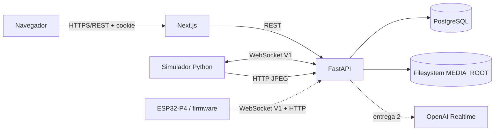

# Portero Inteligente MVP1 — Diseño de la entrega 1

Fecha: 2026-09-04  
Estado: aprobado en conversación, pendiente de revisión del documento  
Raíz del proyecto: `C:\Portero`

## 1. Objetivo

Construir el primer corte ejecutable del MVP1 de Portero Inteligente. Debe funcionar localmente en Windows con PostgreSQL en Docker y con FastAPI y Next.js ejecutados como procesos locales. El sistema será comprobable de extremo a extremo mediante un simulador de dispositivo, sin depender inicialmente de disponer del ESP32-P4 físico.

La entrega permitirá:

- iniciar sesión con una cuenta bootstrap y mantener una sesión web segura;
- administrar usuarios, viviendas, roles y permisos;
- editar y persistir la configuración del agente;
- registrar y aprovisionar dispositivos;
- autenticar un dispositivo mediante challenge-response HMAC-SHA256;
- observar conexión, heartbeat, estado ONLINE/OFFLINE y diagnóstico;
- enviar comandos y observar ACK, RESULT, error o timeout;
- solicitar una captura, recibir un JPEG binario y mostrarlo en el panel;
- consultar eventos, auditoría y estadísticas básicas;
- repetir los flujos anteriores con un simulador Python automatizable.

## 2. Alcance y descomposición

El proyecto completo se divide en tres entregas:

1. **Núcleo simulator-first:** infraestructura local, datos, autenticación, RBAC, panel, protocolo de dispositivos, simulador, comandos, cámara, eventos, diagnóstico y pruebas.
2. **Conversación:** adaptador OpenAI Realtime y streaming bidireccional de audio con barge-in.
3. **Hardware:** integración y validación del firmware sobre el modelo y revisión exactos de la placa ESP32-P4.

Este documento define únicamente la entrega 1. La entrega dejará contratos y puntos de extensión para las entregas 2 y 3, pero no simulará que el audio Realtime o los periféricos físicos fueron validados.

## 3. Decisiones principales

- El repositorio será un monorepo directamente en `C:\Portero`.
- PostgreSQL será la única base principal y se ejecutará con Docker Compose.
- Backend y frontend se ejecutarán localmente durante desarrollo.
- Uvicorn se ejecutará con un único worker en MVP1 porque el registro de WebSockets y las sesiones efímeras de upload viven en memoria. Escalar a varios procesos exigirá un coordinador compartido.
- El desarrollo avanzará mediante cortes verticales demostrables.
- El frontend se comunicará exclusivamente con FastAPI.
- El panel actualizará datos operativos mediante polling REST de intervalo corto. No se añadirá un WebSocket de navegador en esta entrega.
- El backend mantendrá en memoria las conexiones WebSocket activas. PostgreSQL conservará el estado durable y las transiciones importantes.
- Los heartbeats no se almacenarán individualmente. Sólo actualizarán `last_seen_at` y podrán originar eventos al cambiar ONLINE/OFFLINE.
- Los JPEG se almacenarán en filesystem bajo `MEDIA_ROOT`; PostgreSQL conservará metadatos.
- OpenAI quedará encapsulado detrás de `AIRealtimeProvider`. La implementación completa pertenece a la entrega 2.
- La base de firmware tendrá servicios y HAL separados. No contendrá GPIO, PHY, I2S ni cámara inventados.

## 4. Arquitectura



### 4.1 Backend

FastAPI se dividirá por responsabilidades:

- `api`: routers REST, dependencias y respuestas HTTP;
- `auth`: hashing, sesiones, cookies y autorización;
- `database`: engine, sesiones SQLAlchemy y migraciones;
- `models`: entidades persistentes;
- `schemas`: contratos Pydantic;
- `devices`: credenciales, challenge HMAC, presencia y comandos;
- `websocket`: protocolo, registro de conexiones y despacho;
- `media`: validación y almacenamiento intercambiable;
- `audit`: escritura de auditoría sin secretos;
- `ai`: interfaz `AIRealtimeProvider` y diagnóstico de configuración;
- `services`: casos de uso compartidos;
- `main.py`: ciclo de vida, routers, middleware y tareas periódicas.

Las dependencias de infraestructura quedarán detrás de servicios pequeños para poder probar la lógica sin una conexión física ni una cuenta OpenAI.

### 4.2 Frontend

Next.js usará App Router y TypeScript. Las páginas autenticadas compartirán un layout con sidebar colapsable y drawer móvil. Las lecturas y mutaciones pasarán por un cliente HTTP centralizado que enviará cookies y normalizará errores.

React Hook Form y Zod validarán formularios. Pydantic seguirá siendo la validación autoritativa. Recharts mostrará una sola visualización útil: actividad de los últimos siete días.

### 4.3 Simulador

`tools/device_simulator` será un paquete Python independiente que use exactamente el protocolo V1. Admitirá parámetros por CLI o entorno y podrá:

- abrir `/ws/device`;
- ejecutar challenge-response;
- enviar `device.status` y heartbeat;
- procesar comandos con ACK y RESULT;
- generar o seleccionar un JPEG de prueba y subirlo con correlación;
- reconectar con exponential backoff;
- simular errores controlados para pruebas.

### 4.4 Firmware

Se utilizará exactamente la versión de ESP-IDF declarada compatible por el BSP y los ejemplos de la placa seleccionada; no se actualizará automáticamente.

El firmware se organizará en `network_service`, `backend_client`, `device_auth`, `device_state`, `camera_service`, `audio_input_service` y `audio_output_service`. La lógica de protocolo no dependerá del HAL físico.

El repositorio de referencia `C:\PorteroIA\ESP32-P4-Platform` contiene ejemplos oficiales de Ethernet, I2S y cámara, pero soporta varias placas. La integración física requerirá confirmar modelo y revisión. Sus cambios locales existentes no se modificarán.

## 5. Persistencia

Se implementarán las entidades solicitadas:

- `users`, `roles`, `permissions`, `role_permissions`;
- `homes`, `home_users`;
- `devices`, `device_credentials`;
- `agent_configs`;
- `events`;
- `conversations`, `conversation_messages`;
- `media`;
- `device_commands`;
- `audit_logs`.

Se añaden dos entidades técnicas:

- `user_sessions`: hash del token opaco, usuario, expiración, revocación, fechas e información mínima de cliente;
- `device_auth_challenges`: dispositivo, hash/valor seguro del nonce, expiración, consumo y fecha de creación.

Todas las claves internas serán UUID. Los timestamps se guardarán en UTC. La presentación usará el timezone de la vivienda; el valor inicial configurable será `America/Argentina/Salta`. Los campos variables usarán JSONB con límites definidos en los esquemas.

`audit_logs.home_id` y `audit_logs.user_id` serán nullable. Esto permite registrar intentos de login fallidos cuando todavía no existe un usuario o no se conoce una vivienda asociada.

Las relaciones multivivienda serán explícitas. Un usuario no tendrá un único rol global como fuente de autorización: la autorización se resolverá mediante `home_users`.

## 6. Autenticación web y RBAC

El login aceptará username o email y password. Argon2id almacenará únicamente el hash de contraseña.

Al autenticar:

1. el servidor genera un token aleatorio de alta entropía;
2. guarda sólo un hash del token en `user_sessions`;
3. entrega el token en cookie HttpOnly, `SameSite=Lax`, path restringido y `Secure` configurable;
4. renueva `last_login_at` y crea auditoría sin registrar credenciales.

Logout revocará la sesión. Las sesiones tendrán expiración configurable. El frontend no guardará tokens en `localStorage`.

Cada endpoint sensible declarará un permiso. La comprobación recibirá usuario, vivienda y permiso requerido. Ocultar controles en el frontend mejorará UX, pero nunca sustituirá la validación backend.

Roles iniciales:

- `administrator`;
- `owner`;
- `operator`;
- `user`;
- `read_only`.

Permisos iniciales serán exactamente los definidos en el requerimiento original. La migración/seed establecerá un mapa conservador y documentado. El administrador tendrá todos los permisos; los demás sólo los necesarios para su función.

## 7. Bootstrap

Un comando idempotente de backend leerá:

- `BOOTSTRAP_ADMIN_USERNAME`;
- `BOOTSTRAP_ADMIN_EMAIL`;
- `BOOTSTRAP_ADMIN_PASSWORD`.

Creará roles, permisos, la vivienda inicial y el administrador únicamente cuando falten. No habrá contraseña predeterminada ni bootstrap automático silencioso al iniciar el servidor.

## 8. Credenciales y autenticación de dispositivos

Al aprovisionar un dispositivo, el backend generará un secreto aleatorio y lo mostrará una sola vez. PostgreSQL guardará el secreto cifrado de forma autenticada con `DEVICE_CREDENTIAL_ENCRYPTION_KEY`. Los logs y respuestas posteriores nunca lo expondrán.

### 8.1 Handshake

1. El dispositivo abre `/ws/device` y envía `device.hello` con versión, `device_id`, `boot_id` y `seq`.
2. El backend comprueba versión, existencia y estado habilitado.
3. El backend crea un nonce criptográfico de un solo uso y expiración breve y envía `auth.challenge`.
4. El dispositivo calcula HMAC-SHA256 sobre el formato canónico documentado: `v1\n{device_id}\n{boot_id}\n{nonce}`.
5. El backend consume el challenge de manera atómica y compara con `hmac.compare_digest`.
6. Si es correcto, registra la conexión, marca ONLINE y solicita estado.

Un challenge expirado, ya consumido o asociado a otro dispositivo/arranque se rechazará. Las conexiones reemplazadas se cerrarán de forma controlada.

### 8.2 Identidad y duplicados

Cada arranque crea un `boot_id` aleatorio y cada mensaje incrementa `seq`. El backend validará rangos y detectará secuencias repetidas o fuera de orden dentro de la conexión. Los comandos usarán además `command_id` UUID.

## 9. Presencia y estado

El backend conservará la última instantánea de:

- IP;
- firmware y hardware;
- uptime;
- Ethernet;
- cámara;
- micrófono;
- parlante;
- free heap;
- last seen.

El heartbeat actualizará presencia sin crear una fila por latido. Una tarea del ciclo de vida revisará `DEVICE_OFFLINE_TIMEOUT` y generará `device_offline` sólo al producirse la transición. Una conexión autenticada o heartbeat posterior generará `device_online` al recuperar estado.

El intervalo y timeout estarán centralizados en configuración.

## 10. Ciclo de comandos

Un comando se crea como `pending` con `command_id` UUID. Si el dispositivo está conectado pasa a `sent`. El protocolo admite únicamente estas transiciones:

```text
pending -> sent -> acknowledged -> completed
pending -> failed
sent -> failed | timeout
acknowledged -> failed | timeout | completed
```

El dispositivo valida, responde `command.ack`, ejecuta y responde `command.result`. Mensajes desconocidos, duplicados o incompatibles no producirán transiciones inválidas. Los timeouts serán configurables y procesados por una tarea periódica.

Los códigos iniciales serán:

- `AUTH_FAILED`;
- `PROTOCOL_VERSION_UNSUPPORTED`;
- `INVALID_COMMAND`;
- `INVALID_PARAMETER`;
- `DEVICE_BUSY`;
- `CAMERA_NOT_READY`;
- `CAMERA_CAPTURE_FAILED`;
- `MIC_NOT_READY`;
- `SPEAKER_NOT_READY`;
- `INTERNAL_ERROR`.

`access.unlock` no se ejecutará en esta entrega. Cualquier contrato futuro permanecerá deshabilitado o simulado.

## 11. Captura y almacenamiento de media

El panel solicitará `camera.capture`. Al completarse la captura, el simulador/dispositivo hará un `POST /api/device/media` autenticado y correlacionado con `command_id` o `event_id`.

El backend:

1. valida identidad y correlación;
2. acepta únicamente MIME configurados para esta entrega, inicialmente JPEG;
3. impone tamaño máximo antes y durante la escritura;
4. verifica la firma básica del contenido;
5. genera nombre y ruta sin aceptar segmentos enviados por el dispositivo;
6. escribe de forma atómica bajo `MEDIA_ROOT`;
7. crea `media` y `camera_capture`;
8. devuelve sólo metadatos y una URL protegida.

No se usarán Base64, paths libres ni blobs PostgreSQL.

## 12. API REST

La API se organizará bajo:

- `/api/auth/*`;
- `/api/users/*`;
- `/api/homes/*`;
- `/api/devices/*`;
- `/api/events/*`;
- `/api/statistics/*`;
- `/api/agent/*` o recurso anidado equivalente;
- `/api/media/*`;
- `/api/diagnostics/*`;
- `/ws/device`;
- `/health` y `/ready`.

OpenAPI se generará desde esquemas tipados. Las listas tendrán paginación y límites máximos. Fechas, enums, strings, JSON y números tendrán restricciones explícitas.

## 13. Interfaz

La dirección visual será un panel técnico-doméstico sobrio:

- superficies claras y neutras;
- azul petróleo como color principal;
- verde, ámbar y rojo reservados para estados;
- tipografía legible, base mínima de 16 px;
- sidebar colapsable en escritorio y drawer en móvil;
- controles táctiles de al menos 44 px;
- foco visible, navegación por teclado y contraste AA;
- movimiento discreto y compatible con `prefers-reduced-motion`.

Páginas de la entrega:

- Login;
- Dashboard;
- Agente IA;
- Cámara;
- Eventos;
- Estadísticas;
- Usuarios;
- Dispositivos;
- Diagnóstico;
- Configuración básica.

El Dashboard mostrará datos reales: dispositivo principal, conexión, versiones, eventos/conversaciones del día, salud de periféricos/backend/PostgreSQL/OpenAI y última captura.

Las tablas tendrán paginación, filtros, detalle, loading, error y estado vacío. Los formularios tendrán labels persistentes, validación junto al campo y feedback de guardado. Acciones sensibles requerirán confirmación. La pantalla de aprovisionamiento advertirá que el secreto se muestra una sola vez.

El frontend consultará endpoints de estado mediante polling corto y detendrá o reducirá consultas cuando la pestaña no esté visible.

## 14. Errores y observabilidad

Las respuestas de error tendrán:

- código estable;
- mensaje comprensible y seguro;
- detalles de validación permitidos;
- identificador de correlación.

No se devolverán stack traces en producción. Los logs serán legibles en desarrollo y estructurados en producción. Incluirán contexto como `device_id`, `command_id` o `conversation_id`, pero excluirán passwords, cookies completas, secretos, API keys y binarios.

`/health` confirmará que el proceso está vivo. `/ready` comprobará PostgreSQL. El diagnóstico OpenAI será separado para que una caída externa no marque todo el backend como caído.

## 15. Configuración

Pydantic Settings será el único punto de lectura de entorno del backend. Incluirá al menos:

- `DATABASE_URL`;
- `APP_ENV`;
- `APP_SECRET_KEY`;
- `DEVICE_CREDENTIAL_ENCRYPTION_KEY`;
- `OPENAI_API_KEY`;
- `OPENAI_REALTIME_MODEL`;
- `MEDIA_ROOT`;
- `DEVICE_HEARTBEAT_INTERVAL`;
- `DEVICE_OFFLINE_TIMEOUT`;
- origen CORS/frontend;
- flags de cookie;
- timeout de sesión y comandos;
- límites de WebSocket y upload;
- variables bootstrap.

Los `.env.example` usarán únicamente valores ficticios y comentarios. Ningún secreto se incluirá en firmware o frontend.

## 16. Estrategia de pruebas

La implementación crítica seguirá RED-GREEN-REFACTOR. La base de pruebas será PostgreSQL aislado, nunca la base de producción.

### Backend

- hashing y verificación Argon2id;
- login correcto e incorrecto;
- cookie, expiración y revocación de sesión;
- RBAC en distintas viviendas;
- bootstrap idempotente;
- cifrado y descifrado de credencial;
- challenge HMAC correcto e incorrecto;
- challenge expirado y nonce reutilizado;
- dispositivo inexistente o deshabilitado;
- validación de `boot_id` y `seq`;
- creación y transiciones de comando;
- ACK/RESULT duplicado o fuera de orden;
- timeout y cambio ONLINE/OFFLINE;
- validación estricta de payload;
- upload válido, sobredimensionado, MIME/firma inválidos y path traversal;
- endpoints críticos, `/health` y `/ready`.

### Simulador

- formato canónico HMAC;
- serialización de mensajes V1;
- ACK/RESULT;
- backoff con máximo configurable;
- flujo de captura y correlación.

### Frontend

- esquemas Zod;
- login y expiración de sesión;
- protección y visibilidad por permiso;
- edición/restauración de agente;
- estados de carga/error/vacío;
- flujo de comando y captura con API simulada.

### Verificación integrada

Se verificará PostgreSQL saludable, migración desde cero, bootstrap, backend, frontend, simulador, autenticación HMAC, presencia, offline/reconexión, comandos, JPEG y consultas del panel. También se ejecutarán formatters, linters, type checks y builds.

## 17. Entregables

- monorepo con backend, frontend, simulador y base de firmware;
- Docker Compose y volumen PostgreSQL;
- migraciones Alembic completas;
- `.env.example` documentados;
- `docs/device-protocol-v1.md`;
- `docs/architecture.md`;
- README con comandos PowerShell exactos;
- pruebas automatizadas y evidencia de ejecución;
- lista explícita de validaciones no realizadas por falta de hardware/toolchain.

## 18. Criterios de aceptación de esta entrega

La entrega se aceptará cuando, desde un entorno limpio y siguiendo el README, se pueda:

1. levantar PostgreSQL y observarlo healthy;
2. aplicar migraciones y ejecutar bootstrap;
3. iniciar FastAPI y Next.js;
4. iniciar sesión y acceder al Dashboard;
5. editar el agente, recargar y conservar cambios;
6. crear y aprovisionar `PI-000001`;
7. conectar el simulador y observar ONLINE;
8. detenerlo y observar OFFLINE después del timeout;
9. reconectarlo y observar ONLINE;
10. enviar `camera.capture` y observar ACK y RESULT;
11. subir y visualizar el JPEG;
12. consultar eventos, estadísticas, diagnóstico y auditorías permitidas;
13. ejecutar las suites con resultado exitoso.

## 19. Fuera de alcance

No se implementarán todavía reconocimiento facial, app móvil, mensajería externa, video continuo, grabación permanente, MQTT, MinIO, cloud/Kubernetes, OTA productivo, mTLS, cerradura real, pagos, matrículas ni analítica avanzada.

El audio Realtime, barge-in y pruebas con OpenAI pertenecen a la entrega 2. La integración de periféricos y validación sobre placa pertenecen a la entrega 3, salvo que durante la entrega 1 se confirme inequívocamente una configuración oficial compatible.

## 20. Riesgos y mitigaciones

- **Modelo/revisión de placa sin confirmar:** mantener HAL desacoplada y no declarar soporte físico.
- **Toolchain ESP-IDF ausente:** documentar versión y comandos; separar la verificación estática de una compilación real.
- **Estado WebSocket en memoria:** adecuado para un solo proceso MVP; abstraer el registro para migrar a coordinación externa más adelante.
- **Polling del panel:** suficiente para el MVP; centralizar intervalos para migrar a SSE/WebSocket si hiciera falta.
- **Filesystem local:** usar interfaz de almacenamiento y rutas relativas controladas para facilitar futura migración a objetos.
- **Amplitud funcional:** implementar por cortes verticales y exigir pruebas/integración antes de abrir el siguiente corte.
